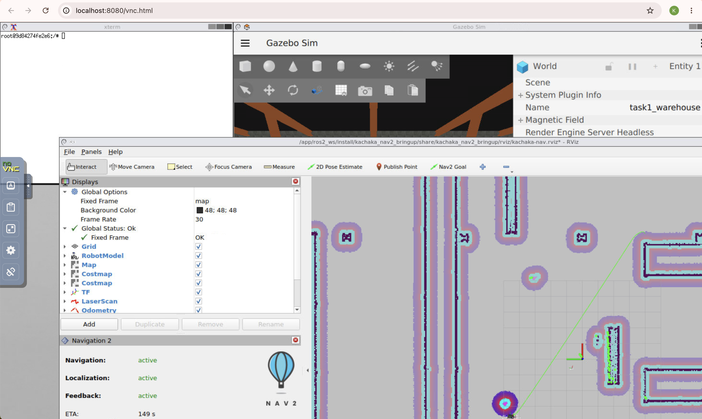

# kachaka_challenge_trail2026

Kachaka ロボットの Gazebo シミュレーション上でナビゲーション・物体検出を学ぶための自律学習環境です。

---

## 目次

1. [リポジトリのセットアップ](#1-リポジトリのセットアップ)
2. [開発環境の準備（Docker）](#2-開発環境の準備docker)
3. [ワークスペースのビルド](#3-ワークスペースのビルド)
4. [シミュレーションを起動する](#4-シミュレーションを起動する)
5. [動作確認（サンプルの実行）](#5-動作確認サンプルの実行)
6. [タスクに挑戦する](#6-タスクに挑戦する)
7. [パッケージを自作する](#7-パッケージを自作する)

---

## 1. リポジトリのセットアップ

### 1-1. このリポジトリを Fork する
前提条件：自身のgithubアカウントを持っていること。

1. GitHub でこのリポジトリを開く
2. 右上の **Fork** ボタンをクリックして自分のアカウントにコピーを作成する

### 1-2. Fork したリポジトリを clone する
前提条件：sshまたはHTTPSでlocalから自身のGitHubに接続できること。

```bash
git clone --recurse-submodules git@github.com:<あなたのGitHubユーザー名>/kachaka_challenge_trail2026.git
cd kachaka_challenge_trail2026
```

> **注意**: `--recurse-submodules` を付けることで `ros2_ws/src/kachaka_ros2_dev_kit/` などのサブモジュールも一緒に取得されます。
> URLはGitHub上の **Code**ボタンからコピーできます。 


---

## 2. 開発環境の準備（Docker）

### 2-1. Docker イメージのビルド（初回のみ・10 分程度かかります）

```bash
# プロジェクトルートで実行
make build-app
```

### 2-2. Docker コンテナを起動する

```bash
# [project_name] を英小文字で入力（同じPCで使うときは区別できるようにコンテナに名前をつけますが、今回は何でも）
./run_docker_container.py <project_name>
```

`-r` オプションをつけると実機 Kachaka にも接続できます（今回はシミュレーションのみ使用）。

### 2-3. VS Code でコンテナに接続する

1. コマンドパレット（`Command+Shift+P`）で `Attach to Running Container...` を検索・選択
2. `<project_name>_sim_kachaka_project_1` を選択

これで Docker コンテナ内の VS Code が開きます。

---

## 3. ワークスペースのビルド

コンテナに入ったら、初回セットアップとビルドを行います。

### 3-1. Python 仮想環境のセットアップ（初回のみ）

```bash
# /app/
uv venv
uv sync
```

### 3-2. ROS2 ワークスペースのビルド

```bash
# /app/ros2_ws/
colcon build --symlink-install
source install/setup.bash
```

> ビルド後は毎回 `source install/setup.bash` が必要です。`.bashrc` に追記しておくと便利です。

---

## 4. シミュレーションを起動する

```bash
# /app/ros2_ws/
ros2 launch kachaka_utils launch_sim.launch.py task:=1
```

`task` 引数でどのタスクのワールドを起動するか選びます:

| コマンド | 内容 |
|---|---|
| `task:=1` | Task 1 — ウェイポイントナビゲーション（5 つのマーカー付き）|
| `task:=2` | Task 2 — ゴミ検出チャレンジ（ボトル 10 個配置）|
| `task:=3` | Task 3 — 完全探索・分類チャレンジ（ボトル/カップ/缶 計 10 個）|
| `task:=0 map_name:=warehouse` | 自由探索（warehouse マップ）|

> **Task 1/2/3 を選ぶと採点ノードが自動起動** します。採点結果はターミナルのログと `/task{N}_judge/status` トピックで確認できます。

Gazebo IgnitionでGUIが不要な場合、`headless:=True`を指定することでヘッドレスモードで起動できます。

キーボードで手動操作する場合は別ターミナルで:

```bash
ros2 run teleop_twist_keyboard teleop_twist_keyboard \
  --ros-args --remap cmd_vel:=/kachaka/manual_control/cmd_vel
```
---

### Rvizを確認する

ros2 launch を起動すると、以下のような RViz の画面が表示されます。

これで以下のようなRvizの画面が見えていたら成功です。（mac以外の方はX11アプリケーションが異なるので、少し違うかもしれません）Costmapが表示されないなどうまくいっていない場合は、再起動するとうまくいくことがあります。



---

## 5. 動作確認（サンプルの実行）

シミュレーションが起動したら、別ターミナルでサンプルコードを動かしてみましょう。

```bash
# コンテナ内の別ターミナル
# /app/ros2_ws/
source install/setup.bash
ros2 run trail_kachaka_sample executor.py
```

このサンプルは Task 1 のウェイポイントナビゲーションを実行します。ロボットが 5 箇所のウェイポイントを順番に巡回し、Task 1 Judge が到達を自動で記録します。

### 採点結果の確認

```bash
# 別ターミナルで採点状況を確認
ros2 topic echo /task1_judge/status
```

---

## 6. タスクに挑戦する

実装すべきタスクの詳細は [`project/competition.md`](project/competition.md) を参照してください。

実装の進め方のヒントは [`project/implementation_guide.md`](project/implementation_guide.md) を参照してください。

---

## 7. パッケージを自作する

自分のパッケージを作るには `ros2_ws/src/` ディレクトリで以下を実行します:

```bash
# /app/ros2_ws/src/
create_ros2_pkg
```

パッケージ名や作成者情報を入力するとテンプレートからパッケージが作成されます。

詳しいパッケージの作り方・ノードの立ち上げ方は [`project/implementation_guide.md`](project/implementation_guide.md) を参照してください。

---

## リポジトリ構成

```
kachaka_challenge_trail2026/
├── ros2_ws/src/
│   ├── kachaka_ros2_dev_kit/     # Kachaka 公式 ROS2 開発キット（サブモジュール）
│   │   ├── kachaka_description/  # ロボット記述ファイル (URDF)
│   │   ├── kachaka_gazebo/       # Gazebo シミュレーション環境・SDF ファイル
│   │   ├── kachaka_interfaces/   # 公式カスタムメッセージ定義
│   │   ├── kachaka_nav2_bringup/ # Nav2 設定・地図ファイル
│   │   └── kachaka_mapping/      # マッピングツール
│   ├── kachaka_utils/            # NavManager など共通ユーティリティ
│   ├── trail_kachaka_msgs/       # チャレンジ用カスタムメッセージ定義
│   ├── trail_task_judge/         # 自動採点ノード（Task 1/2/3）
│   └── trail_kachaka_sample/     # サンプルコード（Task 1 実装例）
├── project/
│   ├── competition.md            # タスク仕様・採点基準
│   └── implementation_guide.md   # 実装ヒント・開発手順
├── docker/                       # Docker 設定ファイル
└── template/                     # パッケージ作成テンプレート
```

---

## Requirements

| 項目 | バージョン |
|---|---|
| hardware | AppleM2で動作確認済みなので、これよりスペックが良ければ。（ちなみにCPU使用率は90%越えでした） |
| Docker | 最新安定版 |
| macOS の場合 | Docker Desktop |

---

## 参考リンク

- [ROS2 Jazzy 公式ドキュメント](https://docs.ros.org/en/jazzy/index.html)
- [Nav2 ドキュメント](https://docs.nav2.org/)
- [Kachaka ROS2 Dev Kit](https://github.com/CyberAgentAILab/kachaka_ros2_dev_kit)
